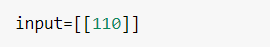

# Developing a Neural Network Regression Model

## AIM

To develop a neural network regression model for the given dataset.

## THEORY


## DESIGN STEPS

### STEP 1:

Loading the dataset

### STEP 2:

Split the dataset into training and testing

### STEP 3:

Create MinMaxScalar objects ,fit the model and transform the data.

### STEP 4:

Build the Neural Network Model and compile the model.

### STEP 5:

Train the model with the training data.

### STEP 6:

Plot the performance plot

### STEP 7:

Evaluate the model with the testing data.

## PROGRAM
``` python3
import pandas as pd

from sklearn.model_selection import train_test_split

from sklearn.preprocessing import MinMaxScaler

df=pd.read_csv("data.csv")

df.head()

x=df[["Input"]].values

y=df[["Output"]].values

x_train,x_test,y_train,y_test=train_test_split(x,y,test_size=0.2,random_state=42)

import tensorflow as tf

model=tf.keras.Sequential([tf.keras.layers.Dense(8,activation='relu'),
                           tf.keras.layers.Dense(16,activation='relu'),
                           tf.keras.layers.Dense(1)])
model.compile(loss="mae",optimizer="adam",metrics=["mse"])

history=model.fit(x_train,y_train,epochs=1000)

import numpy as np

x_test

preds=model.predict(x_test)
np.round(preds)

tf.round(model.predict([[20]]))

pd.DataFrame(history.history).plot()

r=tf.keras.metrics.RootMeanSquaredError()
r(y_test,preds)

```
## Dataset Information


## OUTPUT

### Training Loss Vs Iteration Plot


### Test Data Root Mean Squared Error


### New Sample Data Prediction

sample input


sample output


## RESULT
Thus a neural network regression model for the given dataset is written and executed successfully
